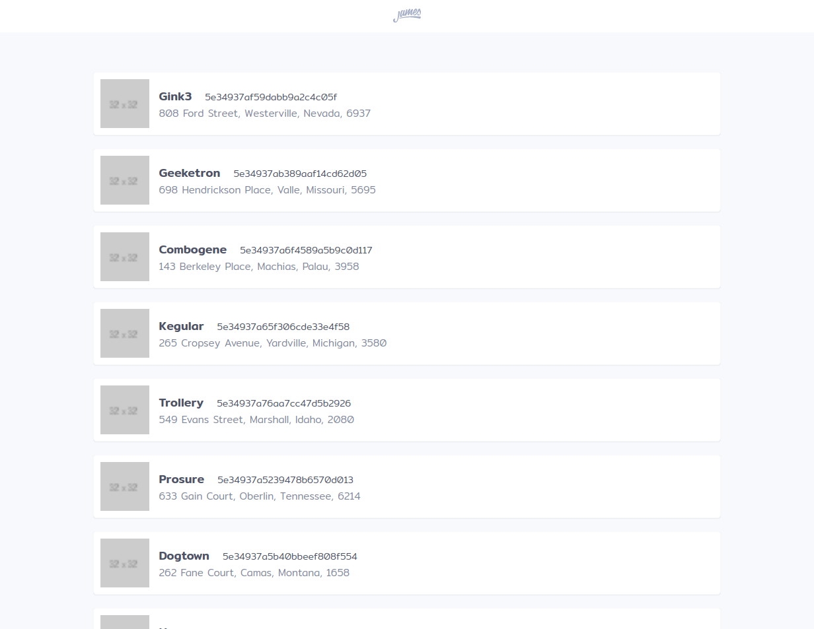
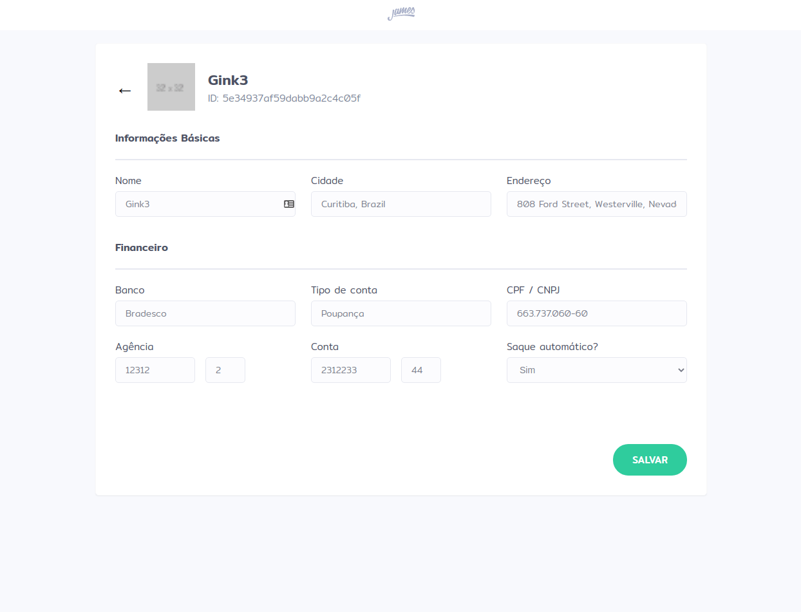

# James Delivery Test Frontend

<h1 align="center">
    
    
    
</h1>

## 💻 Project

This project was generated with [Angular CLI](https://github.com/angular/angular-cli) version 10.2.0.

Project developed for the [James Delivery](https://jamesdelivery.com.br) front-end developer test.

## :rocket: Technologies

This project was developed with the following technologies:

- [Angular](https://angular.io)
- [TypeScript](https://www.typescriptlang.org/)

## :hammer: How to use

To clone and use this application, you will need [Git](https://git-scm.com/), Node.js v12, [Npm](https://www.npmjs.com) and Angular v10 installed.

### Start development environment

```bash
# Clone application
git clone https://github.com/jazielg/james-delivery_test-frontend.git

# Enter the directory
cd james-delivery_test-frontend

# Install dependencies
npm install

# Start application on port 4200
ng serve --open
```

### Build

Run `ng build` to build the project. The build artifacts will be stored in the `dist/` directory. Use the `--prod` flag for a production build.

## 🧠 Challenge

In the following link you will find the description of the challenge.

[Frontend challenge](https://github.com/james-delivery/frontend-challenge)

## :information_source: Further help

To get more help on the Angular CLI use `ng help` or go check out the [Angular CLI Overview and Command Reference](https://angular.io/cli) page.

## :memo: License

This project is under the MIT license. See the [LICENSE](LICENSE.md) file for more details.
